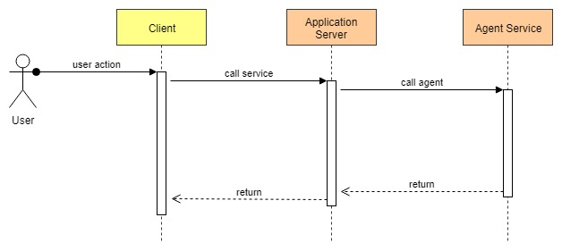

# Tic Tac Toe

## Introduction

I started to work on this project for the purpose of to learn some new technologies. A simple application to put all together what I wanted to study was perfect for my aim. At the present this is a working in progress project that I'm using to learn and study new things. I try to update and do refactoring every sections based on my study.

I take it for granted that this game is known, otherwise it's easy to find on Google something about it.

In the past, every time that a new language came in front of me for work or hobby, I used the Tic Tac Toe game to learn it. MFC, C#, javascript are examples of languages that I learnt thanks to this game. Now there are a lot of new things to know, but I wanted to use the same example.

### Goals

On the client side my goals are to learn react.js (TODO) and redux concepts.

On the server side my goals are to learn node.js and express.

The last goal is to learn python and tensorflow. In the reference section, there is a link to a very good article and code about deep learning, from which I took all the code for the agent project.

During the development other concepts came in my mind, the first one is Docker, so I decided to move all projects on containers. The second one is based on the gift I made to myself, the Raspberry (TODO), so my aim is to move all on that device...step by step.

## Projects

The game is organized in the following projects:

- client
  - angular
  - react (TODO)
- server
  - tictactoe
  - agent
  
In the client folder there are two versions of the same application:

- the first one is written in angular 6+.
- the second one is written in react (TODO).

The projects expose the GUI for the human player.

In the server folder there are two sub folders:

- tictactoe is the project that exposes the web service, based on node.js and express. The clients call it to play ti tac toe.
- agent is the project that exposes the web service to manage the AI, written in python and based on tensorflow. tictactoe project call it to manage the next best move.

### Architecture

In the following picture there is a sequence diagram to show how any single user action is handled by the system.

## Prerequirements

The following requirements are needed to run the system.

## Setup and Run

Once you cloned or downloaded the project from github, you have to install all packages for each project. Follow these steps.

### Setup and Run the Client

The following commands have to run under the folder client\angular through a cmd prompt with administrative privileges.

    npm install

installs all dependencies

Now the client angular is ready to run.

Try it, typing the command defined in package.json

    ng serve run:tic-tac-toe

### Setup and Run the Application Server

The following commands have to run under the folder server\tictactoe through a cmd prompt with administrative privileges.

    npm install

installs all dependencies

Now the tictactoe service is ready to run.

Try it, typing the command

    npm start

### Setup and Run the Agent

The prerequisite to run the agent is to have installed on your computer python 3.6. After a short search on Google you can find and install it.

The following commands have to run under the folder server\agent through a cmd prompt with administrative privileges.

    pip install virtualenv

installs virtualenv package in order to create and use a virtual environment to work in

    virtualenv env

creates the virtual folder env

    env\scripts\activate

activates the virtual environment

    pip install -r agent/requirements.txt

installs in the virtual environment the packages listed in the requirements.txt file

Now the agent service is ready to run.

Try it, typing the command

    python src\TicTacToe.py

## Tests

Each project has a test suite. Follow these steps to run them.

### Test the Client

The following commands have to run under the folder client\angular through a cmd prompt with administrative privileges.

    ng test

### Test the Application Server

The following commands have to run under the folder server/tictactoe through a cmd prompt with administrative privileges.

    npm test

for one cycle of test

    npm test -- -w

for watching file changes

### Test the Agent

The following commands have to run under the folder server/agent through a cmd prompt with administrative privileges.

Create (if it doesn't exist) and activate the virtual folder (see [Setup and Run the Agent](#Setup-and-Run-the-Agent))

    python -m tests.entrypoint

## Docker

Each project can run on a docker container.

### Docker for the Client

The following commands have to run under the folder client\angular through a cmd prompt with administrative privileges.

- build the angular application

        ng build --prod

- create the image

        docker image build -t tictactoe-client .

- run the container listen on port 4200

        docker run -p 4200:80 --rm tictactoe-client

### Docker for the Application Server

The following commands have to run under the folder server\tictactoe through a cmd prompt with administrative privileges.

- create the image

        docker build -t tictactoe .

- run the container listen on the port 3000

        docker run -p 3000:3000 -i -t tictactoe

### Docker for the Agent

The following commands have to run under the folder server\agent through a cmd prompt with administrative privileges.

- create the image

        docker build -t agent .

- run the container listen on the port 8080

        docker run -p 8080:8080 -i -t agent

### Docker for all together

## Raspberry

TODO

## Put all together

TODO

## References

In the following sections the are the references about the main topics. In each project there is a folder README in which it's possible to find other links and examples that I have taken note. 

### Tools for testing

#### Jasmine for Angular

- https://scotch.io/tutorials/testing-angular-with-jasmine-and-karma-part-1

#### Mocha for Node.js

- https://blog.logrocket.com/a-quick-and-complete-guide-to-mocha-testing-d0e0ea09f09d
- https://scotch.io/tutorials/nodejs-tests-mocking-http-requests

#### Unitest for Python

- https://docs.python.org/2/library/unittest.html
- https://medium.com/@ramrajchandradevan/python-init-py-modular-imports-81b746e58aae

### Deep Learning

- https://medium.com/@carsten.friedrich/teaching-a-computer-to-play-tic-tac-toe-88feb838b5e3
